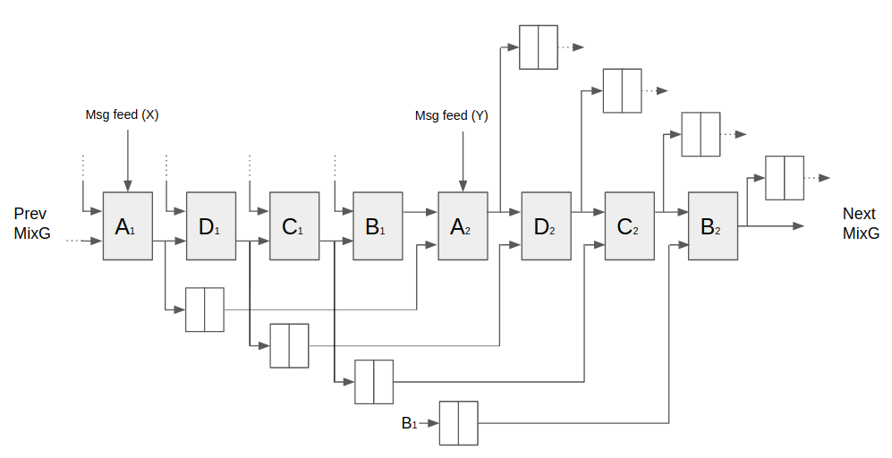
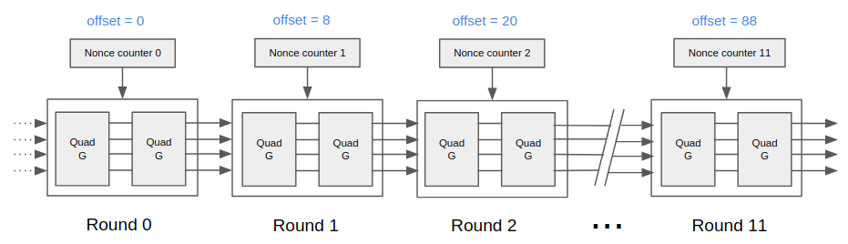

# SiaFpgaMiner #

This project is a VHDL FPGA core that implements an optimized Blake2b pipeline to mine Siacoin. 

Motivation
----------

When CPU mining got crowded in the earlier years of cryptocurrencies, many started mining Bitcoin with FPGAs. The time arrived when it made sense to invest millions in ASIC development, 
which outperformed FPGAs by several orders of magnitude, kicking them out of the game. The complexity and cost of developing ASICs monopolized Bitcoin mining, leading to relatively dangerous 
mining centralization. Therefore, emerging altcoins decided to base their PoW puzzle on other algorithms that wouldn't give ASICs an unfair advantage (i.e. ASIC-resistant). The most popular mechanism
has been designing the algorithm to be memory-hard (i.e. dependent on memory accesses), which makes memory bandwith the computing bottleneck. This gives GPUs an edge over ASICS, effectively democratizing
access to mining hardware since GPUs are consumer electronics. Ethereum is a clear example of it with its [Ethash](https://github.com/ethereum/wiki/wiki/Ethash) PoW algorithm.

Siacoin is an example of a coin without a memory-hard PoW algorith and ~~no ASIC miners~~ some ASIC miners are being rolled out (see [Obelisk](https://obelisk.tech) and [Antminer A3](https://shop.bitmain.com/productDetail.htm?pid=00020180116164357365a2ljX8gx06D3)). 
So was a perfect candidate for FPGA mining! (more for fun than profit)

Design theory
-------------

To yield the highest posible hash rate, a fully unrolled pipeline was implemented with resources dedicated to every operation of every round of the Blake2b hash computation. 
It takes 96 clock cycles to fill the pipeline and start getting valid results (4 clocks per 'G' x 2 'G' per round x 12 rounds).

- **MixG.vhd** implements the basic 'G' function in 4 steps. Eight and two-step variations were explored but four steps gave the best balance between resource usage and timing.
- **QuadG.vhd** is just a wrapper that instantiates 4 MixG to process the full 16-word vectors and make the higher level files easier to understand.
- **Blake2bMinerCore.vhd** instantiates the MixG components for all rounds and wires their inputs and outputs appropiately. Nonce generation and distribution logic also lives in this file.
- **/Example** contains an example instantiation of Blake2bMinerCore interfacing a host via UART. It includes a very minimalist Python script to interface the FPGA to a Sia node for mining.

### MixG

The diagram below shows the pipeline structure of a single MixG. Four of these are instantiated in parall to constitute QuadGs, which are chained in series to form rounds.

The gray A, B, C, D boxes contain combinatorial operations to add and rotate bits according to the G function specification. The white two-cell boxes represent two 64-bit pipelining registers to store results 
from the combinatorial logic that are used later on the process.

### Nonce Generation and Distribution

Pipelining the hash vector throughout the chain implies heavy register usage and there is no way around it. Fortunately the X/Y message feeds aren't as resource-demanding because the work header can remain 
constant for a given block period, with the exception of the nonce field, which must obviously be changing all the time to yield unique hashes. Therefore, the nonce field must be tracked or kept in memory for when a given 
step in the mixing logic requires it. The most simplistic approach would be to make a huge N-bit wide shift register to "drag" the nonce corresponding to each clock cycle across the pipeline. This is not an ideal solution, 
for we would require N flip-flops (e.g. 48-bit counter) times the number of clock cycles it takes to cross the pipeline (48 x 96 = 4608 FF!)

Luckily, the nonce field is only used once per round (12 times total). This allows hooking up 12 counters statically to the X or Y input where the nonce part of the message is fed in each round. To make the counter output 
the value of the nonce corresponding to a given cycle, the counters' initial values are offset by the amount of clock cycles between them. The following diagram illustrates the point:

In this case the offsets show that the nonce used in round zero will be consumed by round one 8 clock cycles after, 
by round two 20 cycles after, and so on. (The distance in clock cycles between counters is defined by the Blake2b message schedule)

Implementation results
----------------------

It is evident that a single core is too big to fit in a regular affordable FPGA device. A ballpark estimate of the flip-flop resources a single core could use: 

* 64-bits per word x 16 word registers per MixG x 4 MixG per QuadG x 2 QuadG per round x 12 rounds = **98,308 registers** (not considering nonce counters and other pieces of logic).

The design won't fit in your regular Spartan 6 dev board, which is why I built it for a Kintex 7 410 FPGA. Here are some of my compile tests:

| Cores | Clock | Hashrate | Mix steps | Strategy | Utilization | Worst Setup Slack | Worst Hold Slack | Failures              | Notes            |
|-------|-------|----------|-----------|----------|-------------|-------------------|------------------|-----------------------|------------------|
| 1     | 200   | 200      | 4         | Default  | 18.00%      | 0.168             | –                | 0                     |                  |
| 2     | 200   | 400      | 4         | Default  | 38.00%      | –                 | –                | 0                     |                  |
| 3     | 200   | 600      | 4         | Default  | 56.00%      | -0.246            | –                | 602 failing endpoints |                  |
| 3     | 200   | 600      | 4         | Explore  | 56.00%      | -0.246            | 0.011            | 602 failing endpoints |                  |
| 3     | 166.67| 500.01   | 4         | Default  | 56.00%      | 0.132             | 0.02             | 0                     |                  |
| 4     | 166.67| 666.68   | 4         | Default  | 75.00%      | 0.051             | 0.009            | 0                     |                  |
| 5     | 166   | 830      | 4         | Explore  | –           | –                 | –                | Placing error         |                  |
| 4     | 173.33| 693.32   | 4         | Explore  | 75.00%      | 0.039             | 0                | 0                     |                  |
| 4     | 173.33| 693.32   | 4         | Explore  | 75.00%      | 0.17              | 0.022            | 0                     | 1 BUFGs per core |

As seen in the table, the highest number of cores I was able to instantiate was 4 and the highest clock flequency that met timing was 173.33 MHz. 

~700 MH/s is no better than a mediocre GPU, but power draw is way less! (hey, I did say it was for fun)

Further work
------------
* Investigate BRAM as alternative to flip-flops (unlikely to fit the needs of this application).
* Fine-tune a higher clock frequency to squeeze out a few more MH/s.
* Porting to Blake-256 for Decred mining. That variant adds two rounds but words are half as wide, so fitting ~2x the number of cores sounds possible.
* Do more in-depth tests with different number of steps in the G function (timing-resources tradeoff).
* Play more with custom implementation strategies.

Resources
---------
* [Official Blake2b spec](https://tools.ietf.org/html/rfc7693#section-3.2). The example computation vectors are extremely useful to test and debug the logic.
* [Blake Wikipedia page](https://en.wikipedia.org/wiki/BLAKE_(hash_function)) that summarizes the algorithm pretty well. 
